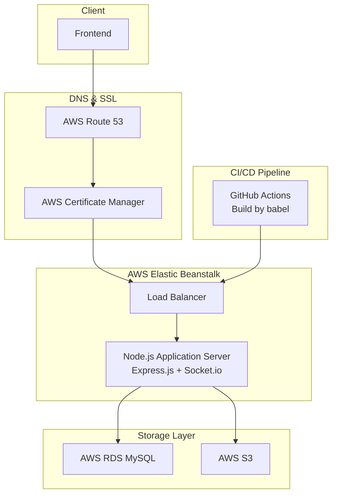

# 🎨 BRUSHWORK

**미대생 졸업 작품 및 아마추어 대상 예술 작품 거래 플랫폼**

[📽️ 시연 영상](https://drive.google.com/file/d/1cKGpDF1SAG6xo6ACMYT70owL8iFRhoFd/view)

[💻 발표 자료](https://drive.google.com/file/d/1KOLNvgfAc8wy98VGQffWypGqZpTZIdht/view)

## 🎯 프로젝트 소개

**개발 기간**: 2023.11 ~ 2024.06 (7개월)

### 🌟 프로젝트 목표
- 미대생 졸업 작품의 체계적인 거래 환경 조성
- 실시간 채팅을 통한 원활한 소통
- 안정적이고 확장 가능한 서비스 인프라 구축

## 🙋 팀원
### PM & DESIGNER
| 닉네임 | Github |
|---|---|
| 칼리/김민정 (PM/팀장) | [@minjeong-kim-git](https://github.com/minjeong-kim-git) |
| 박스/강승현 (DESIGNER) | [@seunghyeonKang](https://github.com/seunghyeonKang) |
### FRONTEND
| 닉네임 | Github |
|---|---|
| 센/박세은 (프론트 리더) | [@marchfirst01](https://github.com/marchfirst01) |
| 몰리/이은수 | [@EunSo0](https://github.com/EunSo0) |
| 챠리/최유리 | [@techncherry](https://github.com/techncherry) |
| 주니/김한주 | [@hanjuuuuuu](https://github.com/hanjuuuuuu) |
### BACKEND
| 닉네임 | Github | 역할 |
| --- | --- | --- |
| 섀넌/한상은 | [@silvarge](https://github.com/silvarge) | 백엔드 파트 리더, 채팅/결제/관심 작품 도메인 담당
| 말리부/정윤호 | [@yunho0310](https://github.com/yunho0310) | 사용자, 인증 도메인 담당
| 이노/장예원 | [@eynow1159](https://github.com/eynow1159) | 작품 도메인, 소셜 로그인 기능 담당

## ✨ 주요 기능

### 🖼️ 작품 관리
- **작품 등록**: 상세 정보와 이미지를 통한 작품 업로드, 판매 방법에 대한 정보 작성을 통한 작품 판매 등록
- **작품 검색**: 다양한 조건으로 작품 검색 및 필터링
- **관심 작품**: 마음에 드는 작품을 위시리스트에 저장

### 💬 실시간 소통(DM)
- **실시간 채팅**: Socket.io 기반 메시지 송수신, 구매 의사 표현 및 거래 논의
- **채팅방 관리**: 거래 및 유저별 독립적인 채팅공간 제공
- **메시지 히스토리**: 과거 대화 내용 저장 및 조회

### 🤝 결제
- **결제**: 토스 결제 API를 이용한 결제 시스템 구현 (테스트 거래까지만 구현)
- **거래 내역**: 과거 거래 기록 조회

### 🔐 사용자 관리
- **회원가입/로그인**: JWT 기반 인증 시스템
- **소셜 로그인**: Kakao, Google 소셜 로그인
- **프로필 관리**: 개인정보 및 작품 이력 관리

## 🛠 기술 스택

### Backend


### Infrastructure


### Tools & Libraries


**상세 기술 스택**
- **Backend**: JavaScript(Node.js), Express.js, MySQL(AWS RDS)
- **Infrastructure**: AWS Elastic Beanstalk, AWS RDS, AWS S3, AWS Route 53, AWS Certificate Manager
- **DevOps**: Docker, GitHub Actions
- **Libraries**: Socket.io, Swagger-jsdoc, Swagger-ui-express, Multer/Multer-s3, JWT, Bcrypt, Cookie-parser, Express-session, CORS, Dotenv, Moment-timezone, UUID

## 🏗 시스템 아키텍처


## 📁 프로젝트 구조 - Layered Architecture

```
📦brushwork_be
 ┣ 📂config
 ┃ ┣ 📜db.connect.js
 ┃ ┣ 📜error.js
 ┃ ┣ 📜response.js
 ┃ ┗ 📜response.status.js
 ┣ 📂public
 ┃ ┗ 📜favicon.ico
 ┣ 📂src
 ┃ ┣ 📂controllers
 ┃ ┣ 📂dtos
 ┃ ┣ 📂middleware
 ┃ ┣ 📂models
 ┃ ┣ 📂providers
 ┃ ┣ 📂routes
 ┃ ┗ 📂services
 ┣ 📜.env
 ┣ 📜.gitignore
 ┣ 📜babel.config.json
 ┣ 📜index.js
 ┣ 📜package.json
 ┣ 📜README.md
 ┣ 📜swagger-output.json
 ┣ 📜swagger.js
 ┗ 📜yarn.lock
```

---
# Ground Rules

## 📋 목차
- [Branch 전략](#-branch-전략)
- [Commit Message 규칙](#-commit-message-규칙)
- [Gitmoji 가이드](#-gitmoji-가이드)

## 🌿 Branch 전략

### Branch 종류
Git Flow 기반으로 다음과 같은 브랜치 구조를 따릅니다.

**영구 브랜치**
- `main`: 제품 출시용 안정 브랜치
- `develop`: 개발 통합 브랜치 (차기 배포 준비)

**임시 브랜치**
- `feature/{이슈번호}`: 새로운 기능 개발
  - 예: `feature/123`, `feature/login-api`
- `refactor/{이슈번호}`: 기존 기능 리팩터링
  - 예: `refactor/456`, `refactor/auth-service`
- `hotfix/{이슈번호}`: 운영 환경 긴급 버그 수정
  - 예: `hotfix/789`, `hotfix/critical-error`
- `release/{버전}`: 배포 준비 브랜치
  - 예: `release/v1.2.0`

### Branch Workflow
```
main ← hotfix ← develop ← feature
                     ↖ refactor
```

**참고**: [Git Flow 상세 가이드](https://techblog.woowahan.com/2553/)

## 💬 Commit Message 규칙

### 기본 구조
```
[Type] 제목 (50자 이내)

본문 (선택사항 - 72자 단위로 줄바꿈)

꼬리말 (선택사항)
```

### 실제 예시
```
✨ [Feat] 사용자 로그인 API 구현

JWT 토큰 기반 인증 시스템 구현
- 이메일/비밀번호 검증 로직 추가
- 토큰 만료 시간 설정 (24시간)

Resolves: #123
Ref: #456
```
